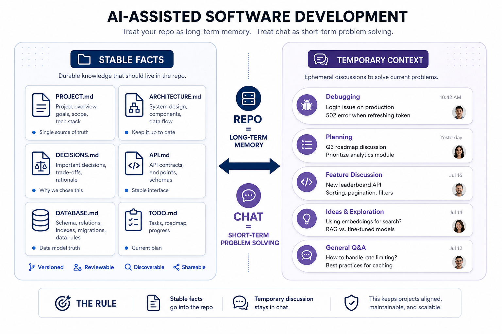

# codex-project-template

An AI-first project documentation template for long-running software projects.

This repository is designed for teams and solo builders who use tools like ChatGPT, Codex, Claude, and Cursor during development and want project knowledge to live in the repository instead of being trapped in chat history.



## Why This Exists

Most project templates focus on code layout.

This template focuses on context layout.

It gives you a lightweight documentation system for the facts that should survive across months of development:

- project scope
- architecture
- technical decisions
- tasks
- API contracts
- data model
- team workflow
- fixed collaboration prompts

The core rule is simple:

- stable facts belong in repository documents
- temporary problem-solving belongs in chat

## Who This Is For

- projects that will last for months, not days
- teams using AI tools repeatedly during implementation
- founders or engineers who want one shared source of truth for humans and AI

## Repository Structure

```text
codex-project-template/
├── README.md
├── LICENSE
├── templates/
│   └── project-init/
├── docs/
│   ├── philosophy.md
│   └── workflow.md
└── examples/
    └── example-web-app/
```

## Included Files

The reusable template lives in `templates/project-init/` and includes:

- `README.md`
- `PROJECT.md`
- `ARCHITECTURE.md`
- `DECISIONS.md`
- `TODO.md`
- `API.md`
- `DATABASE.md`
- `STYLE_GUIDE.md`
- `WORKFLOW.md`
- `PROMPTS.md`

## Quick Start

1. Copy the contents of `templates/project-init/` into the root of your new project.
2. Edit `README.md`, `PROJECT.md`, and `ARCHITECTURE.md` first.
3. Fill in `DECISIONS.md`, `TODO.md`, `API.md`, and `DATABASE.md` as the project becomes concrete.
4. Keep `WORKFLOW.md` and `STYLE_GUIDE.md` aligned with how the team actually works.
5. Update the relevant documents whenever a major change lands.

## Standard Codex Opening Prompt

When starting a new project with Codex, paste this at the beginning of the first working session:

```text
First read README.md, PROJECT.md, ARCHITECTURE.md, DECISIONS.md, TODO.md, API.md, DATABASE.md, STYLE_GUIDE.md, WORKFLOW.md, and PROMPTS.md before making changes.

Treat those files as the source of truth for long-lived project facts.

While working:
- prefer minimal maintainable changes
- do not modify unrelated code
- call out conflicts between code and docs
- after major changes, update any affected project documents

If documentation is missing or stale, fix it as part of the work instead of leaving the project state ambiguous.
```

Why this helps:

- it tells Codex where project memory lives
- it reduces dependence on long chat history
- it encourages code and docs to stay aligned

## Usage Pattern

Use repository documents for long-lived facts:

- what the project is
- what the architecture is
- why key decisions were made
- what contracts must stay stable

Use chats for short-lived context:

- bug investigations
- feature implementation details
- refactor discussions
- one-off design debates

## Example

See `examples/example-web-app/` for a generic filled example showing what the template looks like after it has been adapted to a real project.

## Docs

- [docs/philosophy.md](./docs/philosophy.md)
- [docs/workflow.md](./docs/workflow.md)
- [docs/use-cases.md](./docs/use-cases.md)

## License

MIT
